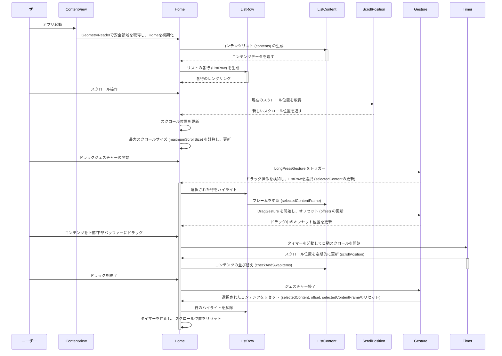

# ドラッグしながらスクロール、コンテンツの位置を変更

https://github.com/user-attachments/assets/a37aa9bf-97c4-47bb-9670-ce93f4550d09

処理の流れ
[コード](Scroll/ContentView.swift)

```mermaid
sequenceDiagram
    participant ユーザー
    participant ContentView
    participant Home
    participant ListRow
    participant ListContent
    participant ScrollPosition
    participant Gesture
    participant Timer

    ユーザー ->> ContentView: アプリ起動
    ContentView ->> Home: GeometryReaderで安全領域を取得し、Homeを初期化
    Home ->> ListContent: コンテンツリスト (contents) の生成
    activate ListContent
    ListContent -->> Home: コンテンツデータを返す
    deactivate ListContent
    Home ->> ListRow: リストの各行 (ListRow) を生成
    activate ListRow
    ListRow -->> Home: 各行のレンダリング
    deactivate ListRow

    ユーザー ->> Home: スクロール操作
    Home ->> ScrollPosition: 現在のスクロール位置を取得
    ScrollPosition -->> Home: 新しいスクロール位置を返す
    Home ->> Home: スクロール位置を更新
    Home ->> Home: 最大スクロールサイズ (maxmumScrollSize) を計算し、更新

    ユーザー ->> Home: ドラッグジェスチャーの開始
    Home ->> Gesture: LongPressGesture をトリガー
    Gesture -->> Home: ドラッグ操作を検知し、ListRowを選択 (selectedContentの更新)
    activate Home
    Home ->> ListRow: 選択された行をハイライト
    ListRow ->> ListContent: フレームを更新 (selectedContentFrame)
    Home ->> Gesture: DragGesture を開始し、オフセット (offset) の更新
    Gesture -->> Home: ドラッグ中のオフセット位置を更新

    ユーザー ->> Home: コンテンツを上部/下部バッファーにドラッグ
    Home ->> Timer: タイマーを起動して自動スクロールを開始
    Timer ->> Home: スクロール位置を定期的に更新 (scrollPosition)
    activate Timer
    Home ->> ListContent: コンテンツの並び替え (checkAndSwapItems)
    deactivate Timer

    ユーザー ->> Home: ドラッグを終了
    Home ->> Gesture: ジェスチャー終了
    Gesture ->> Home: 選択されたコンテンツをリセット (selectedContent, offset, selectedContentFrameのリセット)
    Home ->> ListRow: 行のハイライトを解除
    Home ->> Home: タイマーを停止し、スクロール位置をリセット
    deactivate Home
```

